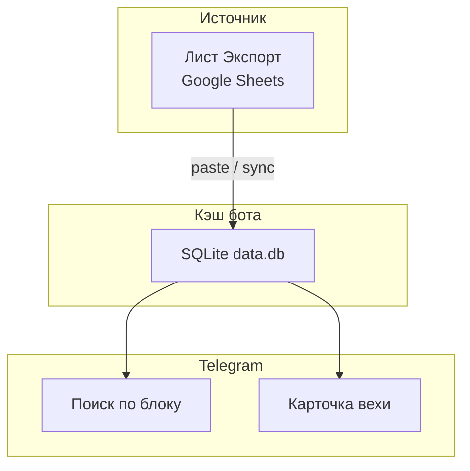
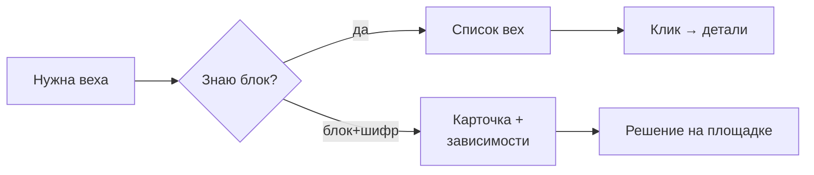
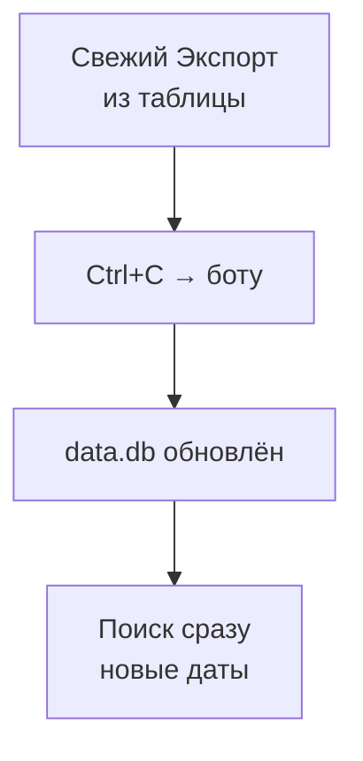

# Milestone Lookup Bot — вехи из таблицы в Telegram

Короче: **лист «Экспорт» → SQLite → поиск и карточки в чате**, без открытия таблицы на телефоне.

Задача: на стройке десятки корпусов и вех, зависимости M/N, plan/fact. В поле нужен ответ за 10 секунд — корпус, шифр, от кого зависит срок.

---

## Что сделано

- **Поиск по блоку** — список вех с датами, inline-кнопки.
- **Карточка вехи** — plan, fact, forecast, цепочка зависимостей.
- **Импорт Ctrl+V** — вставка из Excel/Sheets обновляет кэш.
- **SQLite** — таблица остаётся источником правды, бот — быстрый срез.

---

## Фишки и удобство

| Фишка | Зачем |
|-------|-------|
| Paste-import | Не нужен service account на каждый чит |
| Inline-кнопки | Не простыня текста в чате |
| Зависимости M/N | Как в листе Экспорт |
| Отдельно от digest-бота | Поиск ≠ автоматические пуши |

---

## Схема данных



---

## Процесс пользователя



**Обновление данных:**



---

## Стек

| Слой | Технология |
|------|------------|
| Бот | aiogram 3 |
| Кэш | SQLite |
| Данные | лист Экспорт (paste) |
| Демон | systemd tg_bot |

---

## Структура репозитория

```
README.md
LICENSE
.gitignore
bot/main.py
docs/                     — DIAGRAMS.md (3× mermaid)
examples/.env.example
requirements.txt
```

---

## Быстрый старт

```bash
export TELEGRAM_BOT_TOKEN="..."
python3 main.py
```

Spreadsheet ID — только если подключите service account sync (опционально).
