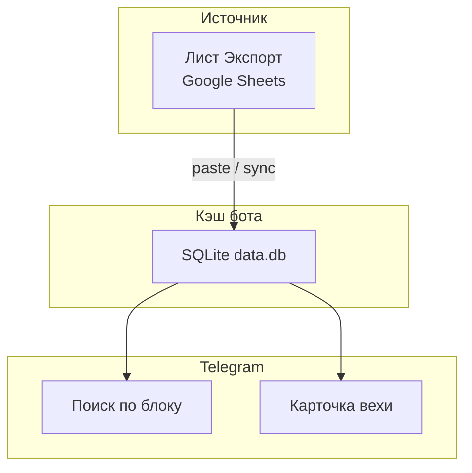
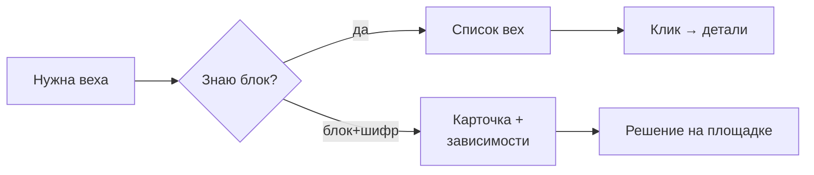
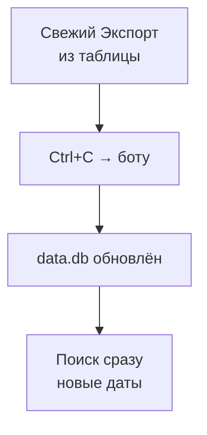

# Диаграммы

Три вида схемы — как в [dataroom-cms](https://github.com/sikuykus-lab/dataroom-cms):
**данные**, **взаимодействие пользователя**, **процессы администратора**.

Рендер: скопировать блок в [mermaid.live](https://mermaid.live).

## Схема данных

## Процесс пользователя

## Процессы администратора

